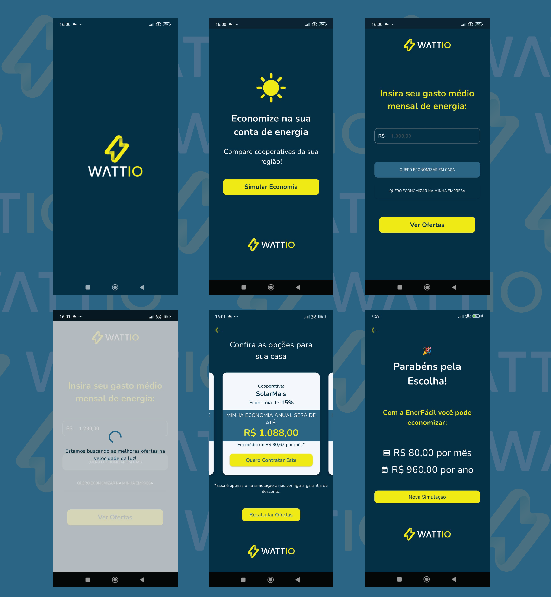

# Teste front-end Wattio

App de teste desenvolvido em Flutter para a vaga de desenvolvedor frontend.

## Funcionalidades

- Tela incial com inserção do valor gasto mensalmente com energia elétrica
- Escolha do tipo de unidade consumidora, Casa ou Empresa
- Escolha do melhor plano
- Realizar contrato com a cooperativa

# Tecnologias e Pacotes usados:

- Flutter (vcesrão 3.29.2)
- Dart (versão 3.7.2)
- Systema Operacional macOS 14.7.5
- flutter_native_splash (Splash Screen)
- flutter_multi_formatter (Máscara monetária)
- intl (Internacionalização)
- confetti (Exibição dos confetis no fim)
- fake_async (Usado para testes em telas com futures)

## Como rodar o projeto
Clone o repositório

`git clone https://github.com/JeffersonSouzaMachado/wattio_teste`

Entre na pasta do projeto

`cd wattio`

Instale as dependências

`flutter pub get`

Rode o app

`flutter run`

Testes

Para rodar os testes unitários e de widget:

`flutter test`

---

## Autor

**Jefferson Machado**

Mobile Developer | Flutter Mobile + Web + Desktop | Driven by a passion for creating beautiful and functional apps.

[LinkedIn](https://www.linkedin.com/in/jeffdevflutter/) | [GitHub](https://github.com/JeffersonSouzaMachado) | thedevjeff@gmail.com

---

> "Code, learn, grow, repeat." 🚀
